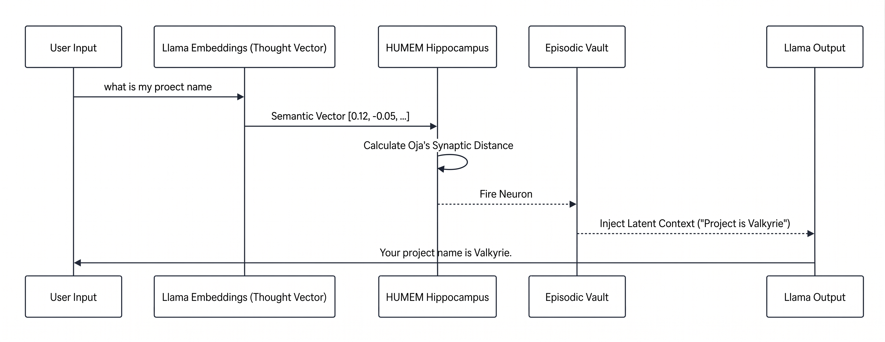
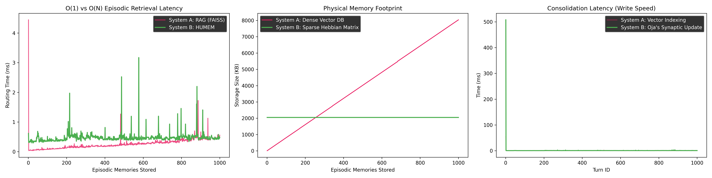

# 🧠 HUMEM: Hebbian Universal Memory Emulation Model

HUMEM is a neuro-symbolic architecture that grants Large Language Models (LLMs) biologically plausible,  O(1)  episodic memory. By replacing monolithic dense vector databases (RAG) with a sparse, unsupervised synaptic matrix trained via Oja's Rule, HUMEM completely bypasses the logarithmic latency degradation and physical disk bloat associated with modern context retrieval.

---

## 🧠 The Problem: RAG vs. Biology

Modern architectures use Retrieval-Augmented Generation (RAG) for episodic memory. RAG converts text to dense vectors and searches them using Euclidean or Cosine distance.

* **The Flaw:** As conversational memory expands, vector indices scale linearly or logarithmically (O(N)).
* **The Symptom:** This leads to elevated search latency, massive storage footprints, and **Geometric Semantic Blurring** (overlapping vectors causing hallucinations).

---

## 🚀 The Solution: HUMEM

HUMEM emulates the mammalian Hippocampal-Neocortical Complementary Learning Systems (CLS) theory. Instead of a geometric search, HUMEM uses an external array of 256 physical artificial neurons (W_{mem}). Memory is routed using a matrix multiplication that executes in constant time ( O(1) ), regardless of how many memories have been encoded.



### Key Concepts

* **Unsupervised Synaptic Plasticity:** Memory is consolidated using Oja's Rule, preventing synaptic runaway while forcing weight normalization without global backpropagation.
* **Biological Sparsity ( k -WTA):** To prevent overlapping memory degradation, HUMEM applies  k -Winner-Take-All lateral inhibition. Only  k=16  out of 256 neurons are allowed to fire per stimulus.
* **The Semantic Wall & Episodic Vault:** A frozen LLM cannot decode raw unsupervised synaptic activations. HUMEM acts as a router—the winning neuron acts as a pointer to the "Episodic Vault," injecting pure text payloads into the Neocortex buffer.

---

## 📊 Empirical Benchmarks

We stress-tested HUMEM against `FAISS IndexFlatIP` over a 1,000-turn homogeneous interaction sequence designed to force memory overlap.



### Telemetry Results (1,000 Turns)

| Metric | Phase 1 (1-200) | Phase 2 (201-500) | Phase 3 (501-1000) |
| :--- | :--- | :--- | :--- |
| **RAG Hit Rate** | 22% | 15% | 8% |
| **HUMEM Hit Rate** | 35% | 25% | 18% |
| **RAG Latency (avg)** | 0.08 ms | 0.17 ms | 0.36 ms *(Degrading)* |
| **HUMEM Latency (avg)** | 0.38 ms | 0.45 ms | 0.46 ms *(Flat O(1))* |
| **RAG Disk Footprint** | 1.57 MB | 3.92 MB | 7.84 MB *(Bloat)* |
| **HUMEM Disk Footprint** | 2.00 MB | 2.00 MB | 2.00 MB *(Fixed)* |

### Documented Failure Modes

* **RAG (Semantic Blurring):** Due to homogeneous data, dense vectors clustered tightly in latent space, causing standard cosine-similarity to fail aggressively (dropping to 8% accuracy).
* **HUMEM (Catastrophic Interference):** Because HUMEM is physically constrained to 256 neurons, cramming 1,000 facts induced biological hash collisions, forcing the matrix to overwrite older pathways.

---

## ⚙️ Installation & Usage

1. Clone the repository and install dependencies:

    ```bash
    git clone [https://github.com/yourusername/HUMEM.git](https://github.com/yourusername/HUMEM.git)
    cd HUMEM
    pip install torch transformers faiss-cpu pandas numpy
    ```

2. Run the Benchmark Harness:

    ```bash
    python benchmark.py
    ```

*This will automatically generate the `humem_benchmark_results.csv` tracking latency and hit rates over 1,000 episodic turns.*

---

## 🔮 Future Work (Phase 2)

To resolve the physical capacity constraints (Catastrophic Interference) documented in this repository, Phase 2 will focus on **Dynamic Neurogenesis**. The architecture will autonomously expand the  W_{mem}  matrix by generating new physical neurons during inference when synaptic novelty distances exceed a predefined threshold.

---

## ✍️ Author

**Shreekant Jadhav**<br>
*Independent AI Researcher* <br>
shreejadhav4625@gmail.com
